# CoinGecko API Server MCP 项目分析文档

## 项目概述

CoinGecko API Server MCP 是一个基于 Node.js 和 Express 的加密货币数据 API 服务器，实现了 MCP (Marketplace Component Program) 协议，允许 AI 系统（如 Claude）通过标准化接口访问 CoinGecko 的加密货币市场数据。

## 技术栈

- **后端框架**: Node.js + Express.js
- **API 客户端**: coingecko-api-v3
- **JSON-RPC**: jayson
- **环境配置**: dotenv
- **开发工具**: nodemon
- **容器化**: Docker
- **协议**: MCP (Marketplace Component Program)

## 项目架构

### 整体架构图

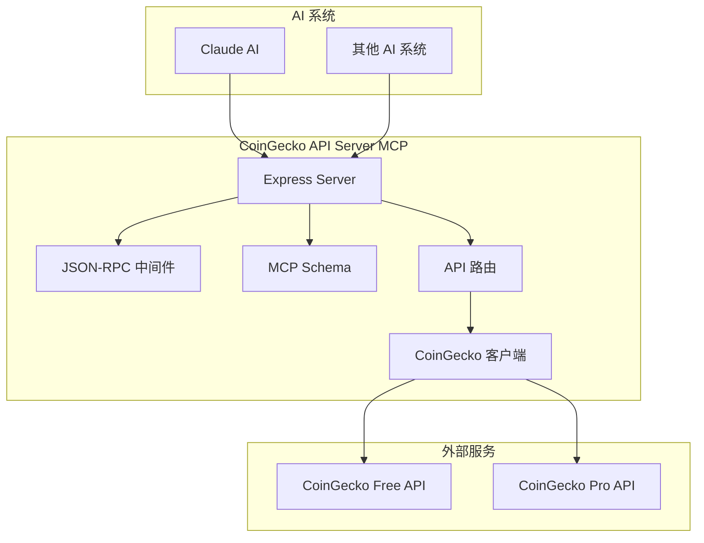

### 核心组件架构

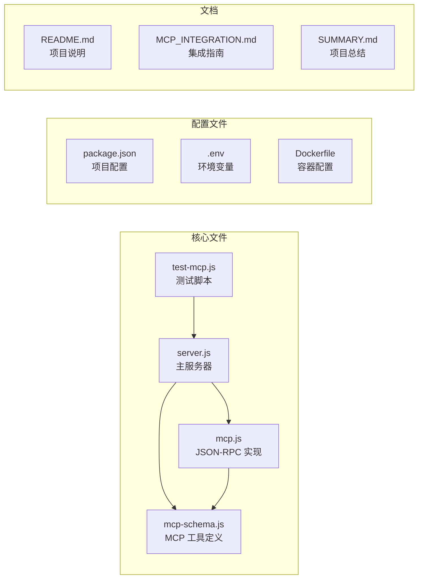

## API 接口设计

### RESTful API 端点

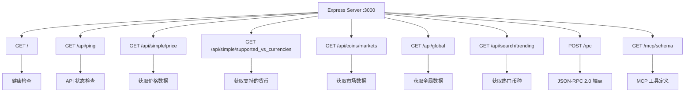

### MCP 工具方法

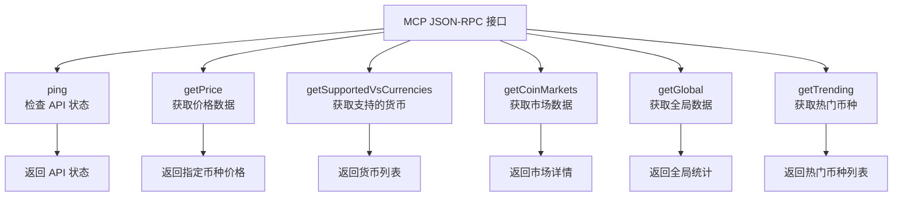

## 数据流程

### API 请求流程

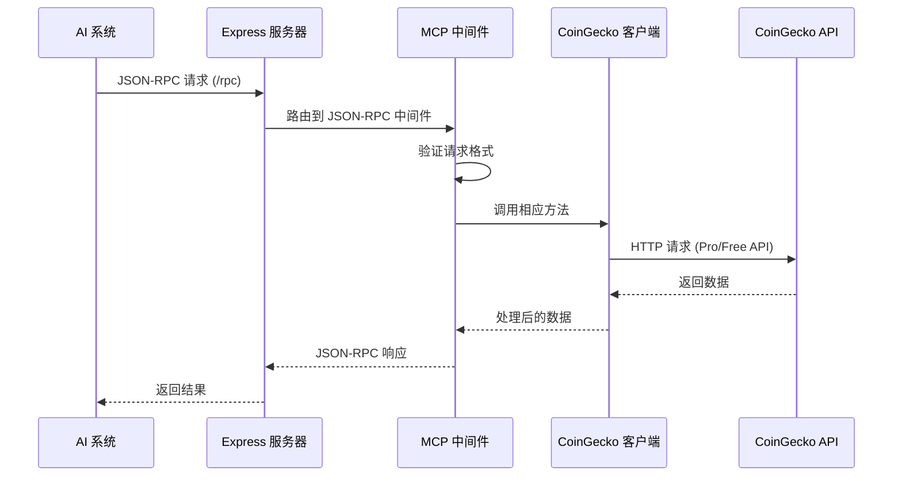

### API 切换逻辑

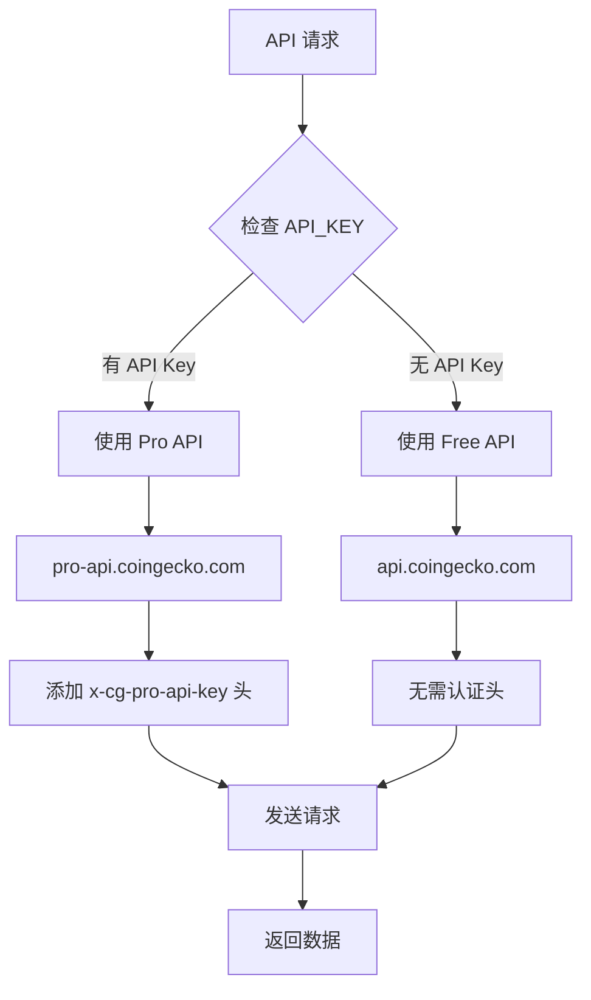

## 文件结构分析

### 主要目录结构

```
CoinGeckoMCP/
├── CG-MCP/                    # 主要项目目录
│   ├── server.js              # Express 服务器主文件
│   ├── mcp.js                 # JSON-RPC 2.0 实现
│   ├── mcp-schema.js          # MCP 工具定义
│   ├── test-mcp.js            # MCP 集成测试
│   ├── package.json           # 项目依赖配置
│   ├── bin/
│   │   └── setup.js           # 安装设置脚本
│   └── 文档文件...
├── Dockerfile                 # Docker 容器配置
├── LICENSE                    # MIT 许可证
└── README.md                  # 项目说明
```

### 核心文件功能

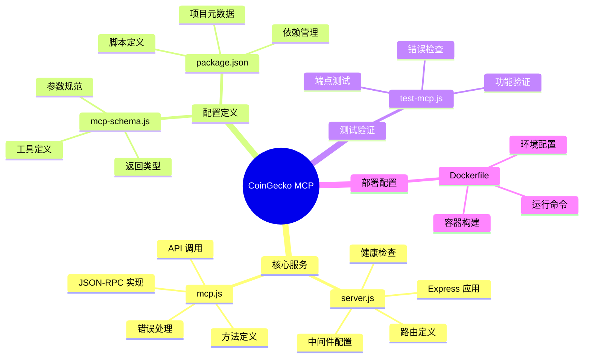

## 功能特性

### 主要功能

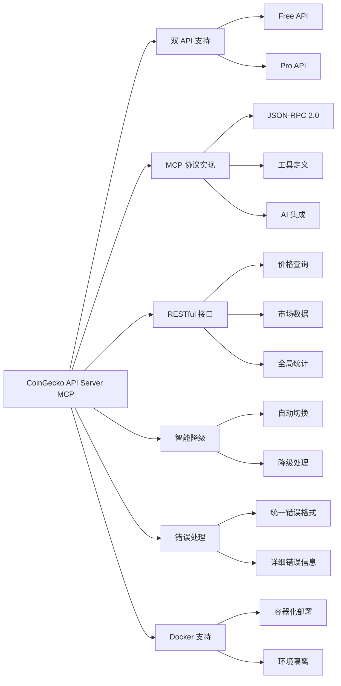

## 部署架构

### 部署选项

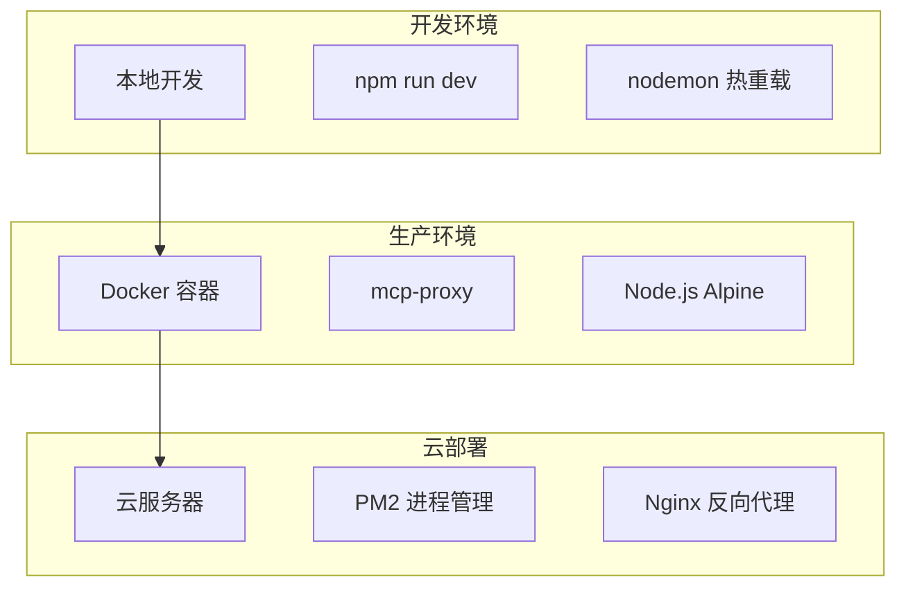

### 环境配置

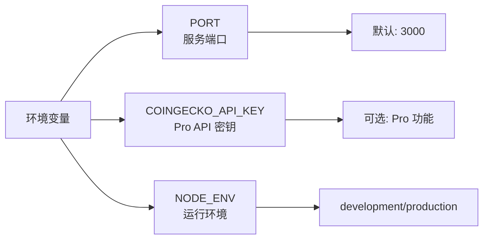

## 使用场景

### AI 集成场景

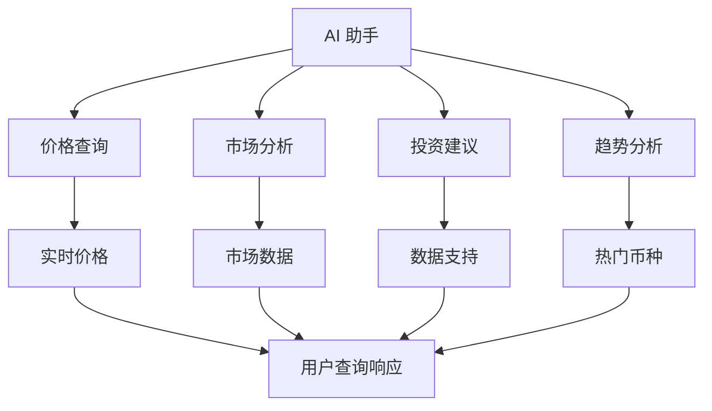

### 应用场景

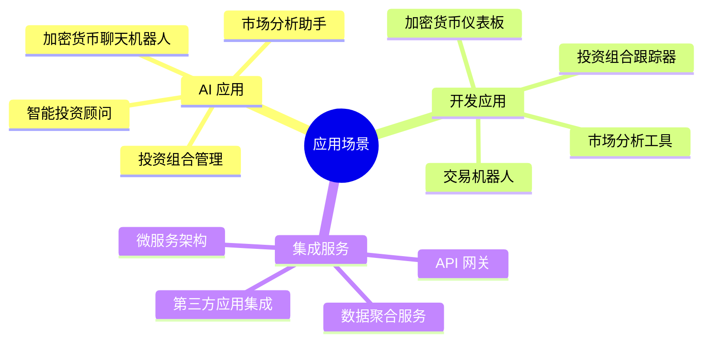

## 技术优势

### 架构优势

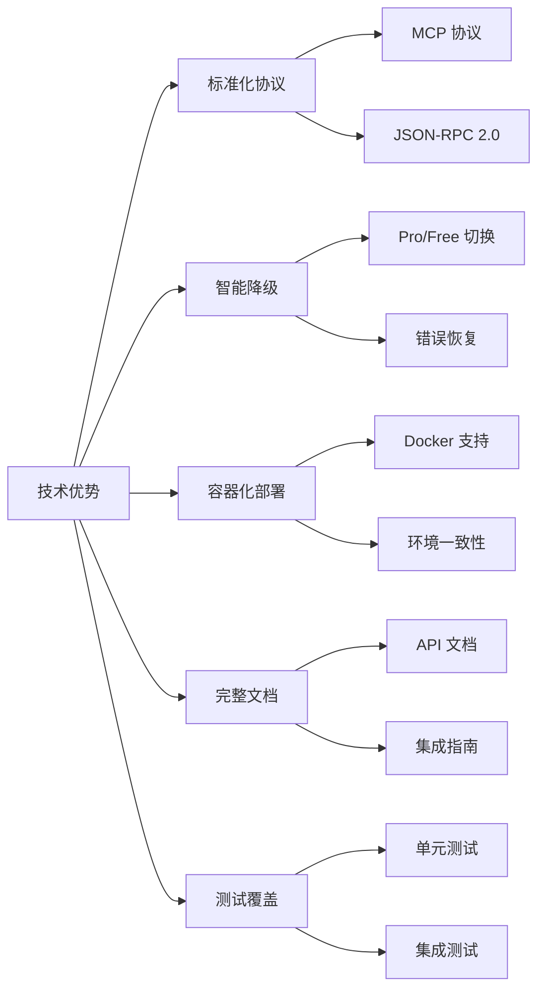

## 总结

CoinGecko API Server MCP 是一个设计良好的加密货币数据服务项目，具有以下特点：

1. **标准化接口**: 实现了 MCP 协议，支持 AI 系统无缝集成
2. **双重支持**: 同时支持 CoinGecko 免费和专业版 API
3. **智能降级**: 自动在不同 API 版本间切换
4. **完整生态**: 包含完整的文档、测试和部署配置
5. **容器化**: 支持 Docker 部署，便于生产环境使用
6. **开发友好**: 提供热重载开发模式和详细的错误处理

该项目为 AI 系统访问加密货币数据提供了一个可靠、标准化的解决方案，适合用于构建智能投资顾问、市场分析工具等应用。